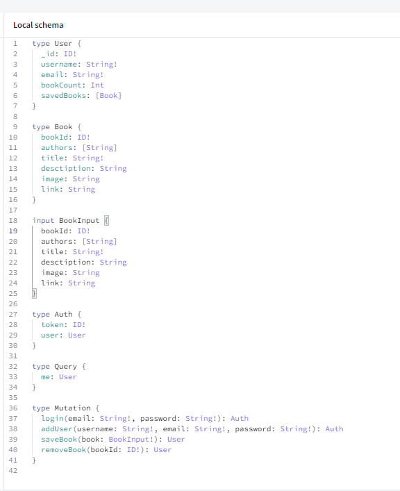

# MERN-Search Engine: googlebooks

## Description

## Table of Contents

  - [Description](#description)
  - [Installation](#installation)
  - [Usage](#usage)
  - [How to Contribute](#how-to-contribute)
  - [Tests](#tests)
  - [Questions](#questions)
  - [Mockup](#mockup)
  - [Heroku Deployed Link](#heroku-deployed-link)

## Installation

To install this application, you will need to clone the repo and run a few commands into the terminal. 

**Installs include**:

* ``npm init`` followed by ``npm install`` (These commands will install the dependencies needed for the package.json)

>_If you want to learn more about any of these npm packages, [click here](https://www.npmjs.com/)._

## Usage

## How to Contribute

When creating an open source project on GitHub, there is always the option for other developers to contribute to your projects. | If you would like to contribute, please contact me at the email listed below.

## Tests

At this time, no tests have been documented for this application.

## Questions

Please reach out with any questions you may have about this application.

* :octocat: GitHub: [@lindsey-lansford](https://github.com/lindsey-lansford)
* :envelope: Email: lindsey.lansford@gmail.com

-------------------------------------------------------
## Mockup

## Heroku Deployed Link

[Click here to view my deployed application]()